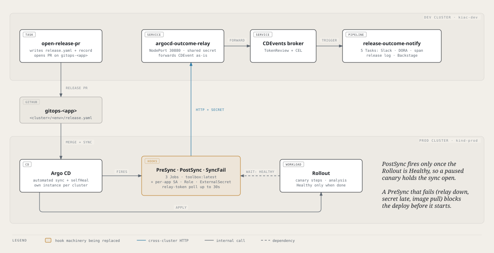
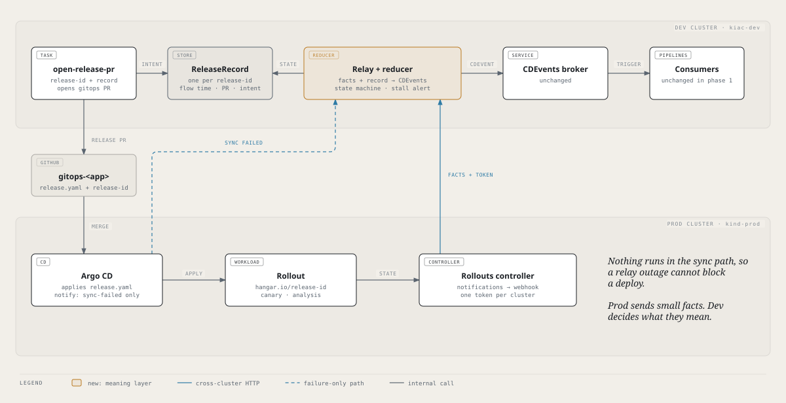
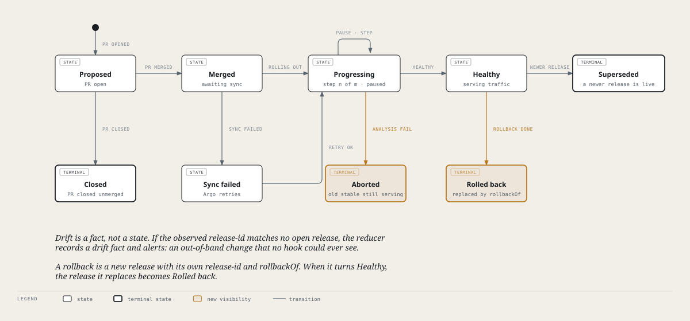
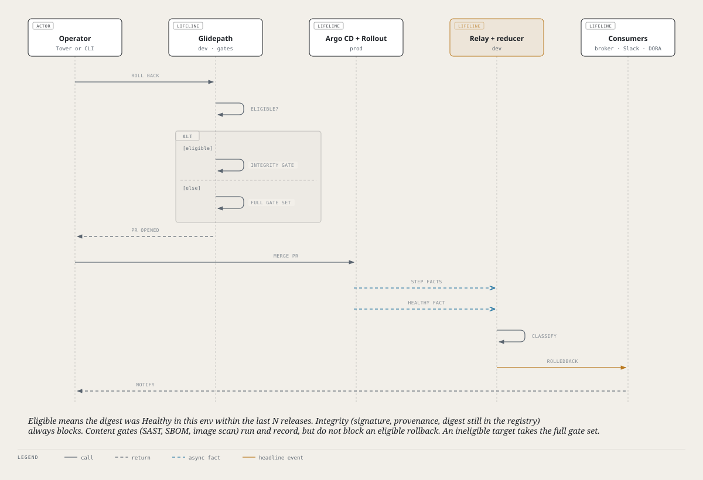

# ADR-0021: Release events are facts from the Rollout, interpreted on dev

*Status: Accepted. Phases 0 to 3c are built and live (2026-10-06): facts from the Rollout,
the reducer, the hooks removed, the relay renamed `glidepath-relay`. Phase 4 (rollback) is
designed in [Phase 4: rollback](#phase-4-rollback-design-2026-10-10) below and in progress.
Supersedes the mechanism in [ADR-0005](0005-multicluster-per-cluster-argocd.md); that ADR's
trust boundary and its per-cluster ArgoCD decision are kept.*

## Context

A release to a Flight environment on another cluster is reported back to the dev cluster
by three Argo CD sync-hook Jobs (`PreSync`, `PostSync`, `SyncFail`) rendered by
`airframe-application` (`templates/release-tracking/hooks.yaml`). Each runs
`catalog/lib/argocd-outcome-hook.sh`, which builds a CDEvent from about eight values baked
into `release.yaml` and POSTs it to `argocd-outcome-relay`, which forwards it to the broker.
Each event then starts a `release-outcome-notify` PipelineRun (five Tasks). The full
history, including why hooks replaced Argo CD Notifications, is in
[multi-cluster.md](../multi-cluster.md).

The mechanism works and is live on five apps (baggage, boarding, checkin, flight and gate,
all `kind-prod/staging`, all Rollouts). It has costs, and the roadmap now needs things it
cannot do.

**Costs that are observed or follow directly from the code:**

- **PreSync runs in the deploy path.** A PreSync Job that fails stops the sync before the
  Rollout is touched. The Job pulls `toolbox:latest`, waits up to 30 s for an ESO-synced
  Secret, and calls a remote relay. Any of those failing is a failed deploy.
- **Per-app machinery.** Each tenant carries three Jobs, a ServiceAccount, a Role, a
  RoleBinding and an ExternalSecret (in `airframe-identity`), a `relayHostAliasIP`, and
  about eight baked fields including a base64 `cicd.yaml`. Argo CD's retry sweep deleting
  that ServiceAccount under a running Job (2026-09-18) is the same design pressure.
- **Dev spawns a lot per release.** Every event is a PipelineRun with five Task pods.

**Cost confirmed in Phase 0 (spike S1; a control without the hook finished in 0 s):** `PostSync` runs only once the
Application is Healthy, and a canary that is paused or running analysis is not Healthy.
The sync operation therefore stays Running for the whole canary, so a revert merged during
a bad canary may not start syncing until the operation ends.

**What hooks cannot see, by construction.** They fire inside a sync. They never see an
auto-abort by an AnalysisRun, a manual `abort`, an out-of-band edit, or a rollback that is
not a sync. We have not talked about rollback yet, and it is exactly the case that leaves
no sync behind.

### Why not Argo CD Notifications (revisited)

Argo CD Notifications was replaced in August 2026 because it fired on self-heal. That test
used `oncePer: app.status.operationState.finishedAt`, which cannot distinguish self-heal
from a release. Argo's own deployment pattern keys `oncePer` on
`operationState.syncResult.revision`. A heuristic circulating in a design review,
`syncResult.revision != sync.revision`, does not work: during a real release both fields
hold the new revision. Even a correct trigger would still not solve the real problem:
Argo CD templates see `.app` only, never the Rollout's annotations, so release identity
cannot ride along.

## Decision (proposed)

1. **Prod emits facts, not events.** The Argo Rollouts controller already on every
   cluster (v1.9.1 on kind-prod) has a built-in notifications engine. Its templates
   receive the whole `.rollout` object, annotations included. One webhook service and one
   template per cluster post a small JSON fact on each Rollout phase change: rollout
   identity (namespace, name, uid), `metadata.generation`, `status.phase`, current step
   and step count, `currentPodHash`, `status.abort`, the images, a timestamp, and the
   `hangar.io/release-id` annotation. A fact carries no `cicd.yaml`, no flow time, no PR
   data. Subscription is by label (`hangar.io/release-tracked=true`) rather than a
   per-app annotation, if the engine supports it (spike S2).
2. **Release identity rides on the Rollout.** `open-release-pr` already writes
   `release.yaml`. It adds one machine-owned value, `release.id`, and the
   `airframe-application` chart renders it as `hangar.io/release-id` on the Rollout's own
   metadata (not the pod template, so it never forces a new ReplicaSet). The chart has no
   Rollout-metadata annotation support today; adding it is part of Phase 1. The id is
   opaque and unique per release to one environment, for example `<chain-id>:<cluster>/<env>`.
3. **Dev holds the meaning.** `open-release-pr` already writes a `release-tracking-<chain-id>`
   ConfigMap on dev for `pr-url` and `pr-created-at`. It becomes the **ReleaseRecord**: it
   also carries flow start time, `cicd.yaml` snapshot, PR, target digest, kind
   (`promote` or `rollback`) and `rollbackOf`, and it is kept until the release is
   terminal plus a TTL instead of being deleted on first read. `argocd-outcome-relay`
   becomes a reducer: it authenticates a fact, joins it to the record by `release-id`,
   advances the state machine below, and emits the **same CDEvents as today**
   (`environment.deploying`, `environment.deployed`) so the broker, Triggers,
   `release-outcome-notify`, DORA, the release log and the outcome span are unchanged in
   phase 1. New event types (`service.rolledback` and others) come later and follow
   [ADR-0022](0022-cdevents-conformance-and-vocabulary.md), which also retires
   `environment.deploying` / `environment.deployed` (not CDEvents spec events).
4. **Argo CD Notifications return in one narrow role: sync failure.** A sync that fails
   before the Rollout changes produces no Rollout fact. One Argo CD trigger on `argocd-apps` (the tenant instance; kind-prod runs two),
   `operationState.phase in [Failed, Error]`, posts a failure fact keyed by the gitops
   revision. Dev maps revision to release by the open record for that app and env.
5. **Auth and transport.** One bearer token per cluster, stored in the
   `argo-rollouts-notification-secret` that the install already ships, checked by the
   relay against `cluster-registry` exactly as now, including the rule that
   `subject.content.cluster` must match the authenticated path. The per-app
   ServiceAccount, Role, RoleBinding, ExternalSecret, `relayHostAliasIP` and the three Jobs
   are deleted. The DNS gap for `*.kiac.local` becomes one fix on one Deployment instead of
   one per app.
6. **Delivery is at-most-once per fact, and a failure is silent** (confirmed in Phase 0,
   [findings](0021-phase0-findings.md)): with the receiver down the engine logged no error,
   marked the facts notified, and never redelivered. So the stream must be made
   level-triggered. A **heartbeat trigger** re-sends current state once per time bucket (the
   Rollouts controller re-reconciles every rollout every 15 minutes, so a lost fact becomes
   a late one), and the **stall alert** (a record merged with no fact for N minutes) is
   mandatory. The fact id is deterministic, `(rollout uid, generation, phase, step)`, and the
   reducer is idempotent. The heartbeat works but adds one key per resync to the Rollout's
   unpruned `notified...` annotation (about four weeks to the 256 KiB cap). **Decided
   (owner, 2026-10-05): keep the engine and add a small prod CronJob that strips the
   `notified...` annotation from tracked Rollouts on a schedule.** That bounds the annotation
   and, because the engine then sees empty state, resends the current state at the next
   reconcile, which is the heartbeat. It needs a Role that can patch Rollouts. The prod-side
   adapter remains the fallback if the CronJob proves unreliable (see the findings).
   Two further rules from Phase 0: every trigger must require
   `observedGeneration == string(generation)` (without it the engine sent `Healthy` facts
   carrying the new release-id and the old pod hash before the controller had seen the
   update), and the reducer counts a fact as a release event only when the release-id or
   image changed (scale and restart produce facts with an unchanged pod hash).

7. **Rollback is a release.** A rollback is a new release: new `release-id`, the target
   digest of an earlier release, `rollbackOf: <old release-id>`, `reason`. It goes through
   the same PR, gates, merge and facts as any other, and when it turns Healthy the reducer
   marks the release it replaced `rolled-back` and emits `service.rolledback`. A hand
   `git revert` restores the old `release-id` and cannot be told from the original, so the
   reducer treats an observed `release-id` that matches no open record as **drift** and
   alerts, instead of guessing.

8. **Gates on a rollback PR (accepted 2026-10-05).** Gates are split by what they
   protect, not skipped as a set. Using the current `releaseGuardrails`:

   | Class | Gates | On a rollback to an *eligible* target | Why |
   |---|---|---|---|
   | Integrity | `provenance`, `values`, commit signing, and "the digest still exists in the registry" | **Block**, always | Cheap, deterministic, and they prove the thing we are about to run is the thing we built. A rollback must never be a way around them. |
   | Content | `sast`, `sbom`, `image-scan` | **Run and record, do not block** | The target already ran in this environment. A CVE database that moved overnight must not be able to stop recovery, and re-running SAST on unchanged source cannot find anything new. |
   | Process | `itsm`, `qa`, `policy-validation`, `image-promotion` | Unchanged | The class is named for what the gates protect, not their build state: these four are stubs today and stay loud as ADR-0003 requires. |
   | Approval | CODEOWNERS review on Flight | **Unchanged** | "An approval that can be skipped is not an approval" (ADR-0020). |

   **Eligible** means the digest was Healthy in this exact app, environment and cluster
   within the last N releases (default 5), as the ReleaseRecord proves. Anything else is
   an ordinary promotion and takes the full gate set.

   *Alternative considered:* run every gate and rely on the existing break-glass bypass.
   It needs no new policy code, and for most rollbacks it is fine. It was not chosen as
   the default because a rollback that must be bypass-merged at an unattended hour makes
   `bypass` a normal event, and then the DORA bypass metric and the Slack alert stop
   meaning anything. Advisory content gates keep `bypass` rare. The cost is that a
   rollback can reintroduce an image with a known finding. The finding is recorded on the
   rollback's own check runs and shown in the Release Record, so the choice is visible.

9. **Workloads with no Rollout (accepted 2026-10-05).** Today there are none that
   use release tracking: the one `rollout: null` release (`gitops-infra-skyport-broker`)
   has no `release.yaml` and no release flow. So **no Argo CD fallback is built now.**
   The fact schema is source-agnostic (`source: rollout | argocd | task`), and the chart
   **fails to render** when `releaseTracking` is set on a release with no Rollout, rather
   than silently emitting nothing. When a real consumer appears, the fallback is an Argo
   CD `on-deployed` trigger (`phase == Succeeded && health == Healthy`, `oncePer` on
   `syncResult.revision`), joined on dev by gitops revision. The join needs one GitHub App
   call per release (`commits/{sha}/pulls`), cached in the record, and the GitHub rate
   limit is a standing problem on this platform, so that cost is the reason not to build
   it speculatively. Cloud targets (`aws-ecs`, `aws-lambda`, `azure-container-apps`)
   already deploy from a Task on dev and emit facts of the same shape directly.

## Consequences

**Gains**

- No Job in the sync path. A relay outage, a late secret or an image pull can no longer
  fail or delay a deploy.
- Per-app delivery machinery drops to one label and one annotation, and one webhook per
  cluster.
- The reducer sees aborts, analysis failures, out-of-band changes and rollbacks, which no
  sync hook can.
- Canary step and analysis state arrive as facts, so a Tower canary timeline and
  per-step spans become possible without more prod-side machinery.
- Change-failure rate and time to restore become defensible: an abort or rollback is a
  failure, and the restoring release is the restore.
- Flow start time stays authoritative on dev. It cannot be derived from Argo (`startedAt`
  is deploy time, not commit time) and the DORA lead-time anchor depends on it.

**Costs and risks**

- **The reducer is stateful.** `argocd-outcome-relay` is stateless today. State lives in
  ConfigMaps, so the reducer can be one replica and recover by reading them, but it is a
  component whose bugs now matter more.
- **The Rollouts controller is in the event path.** Its notifications engine, its
  `oncePer` bookkeeping annotation on the Rollout, and its retry behaviour are all things
  we would be depending on and have not verified (S2).
- **A chart change and a tag.** Rollout metadata annotations are a chart gap. The change
  needs the airframe tag and all three pin locations bumped.
- **Rollout-shaped.** The model fits Rollouts well and everything else poorly. That is
  acceptable only because there are no other release-tracked workloads today (item 9).
- **Facts are not durable on prod.** If the relay is down for longer than the engine
  retries, facts are lost. Mitigated by the stall alert and by Tower reading Rollout
  status directly, not eliminated.

## Unverified, to be settled by Phase 0 before any code

| # | Question | How |
|---|---|---|
| S1 | Does a paused canary hold the Argo CD operation open today? How long do PreSync and PostSync actually take per release? | Read `operationState` during a paused canary on a kind-prod app; read the hook Jobs' timestamps for recent releases. |
| S2 | On Rollouts 1.9.1: webhook headers from the secret; `.rollout` annotations visible in templates; `oncePer` semantics and its state annotation; subscription by label selector; behaviour when the receiver is down; does the extra annotation make Argo CD show OutOfSync? | Install the config on one kind-prod app's namespace, point it at a request catcher. |
| S3 | Which facts arrive for a normal canary, an abort, a scale-only change, a restart, and `kubectl argo rollouts undo`? Does selfHeal revert an `undo`? (Expected yes, which would make `abort` the emergency lever and the rollback PR the way git catches up.) | Capture on a throwaway app. |
| S4 | Can the Rollouts controller pod reach the dev relay (DNS, NetworkPolicy)? | One `hostAliases` patch or an IP URL on one Deployment. |
| S5 | Re-enable Argo CD notifications on kind-prod for the failure-only trigger. | Bootstrap config; test with a broken manifest. |
| S6 | Do byte-identical CDEvents come out of the new path and the hook path for the same release? | Run both on one app in phase 1. |

If S2 fails (for example the engine cannot send the fields we need, or retries are
unusable), this ADR is withdrawn and the fallback is a small prod-side adapter that watches
Rollouts and relays facts. That keeps the same architecture with one more component.

## Build order

| Phase | What | Verifiable by |
|---|---|---|
| 0 | Spikes S1 to S5 | A written findings note. Stop if S2 fails. |
| 1 | `release.id` in `release.yaml`; chart renders `hangar.io/release-id` and the tracked label; prod notification config and the prune CronJob in the kind-prod gitops repo; relay `/facts/<cluster>` that emits today's CDEvents; hooks left running on the same app (S6) | Both paths emit equal CDEvents for one real release; no spurious event from a scale or self-heal |
| 2 | Retained ReleaseRecord, reducer state machine, idempotency, stall alert, drift fact | Replay of the S3 captures reaches the expected states |
| 3 | Cut over the five apps; delete the three hook Jobs, `airframe-identity` ServiceAccount, Role and ExternalSecret, `relayHostAliasIP`, `argocd-outcome-hook.sh`, and the `configJsonB64` and baked tracking fields | A release with the hooks gone; the PostSync wait is gone |
| 4 | Rollback: the PR backend, the eligibility check, the advisory gate mode, `service.rolledback` | A live rollback on a throwaway app |
| 5 | Per-step spans, Tower canary timeline, cloud-target facts | |

Phases 1 and 3 change `airframe` (a tag and three pin bumps) and the cluster gitops repos
(PRs). Phase 2 and 4 change `glidepath`, and any schema change there needs the toolbox
rebuild and `toolboxImage` bump in all three values files.

## Not decided here

- ~~Whether Tower offers **abort**~~ Decided 2026-10-09: Tower offers every Argo Rollouts
  action (abort, pause, resume, promote, promote-full, retry, restart) through Argo CD's
  built-in Rollout actions, owner-only; on Flight, promote and promote-full are audited and
  announced as a bypass of canary analysis (backstage `towerPermissions.ts`, tower#55).
- Auto-rollback on an SLO burn. The Rollout already aborts on AnalysisRun failure; whether
  Glidepath should also open the rollback PR automatically is a separate decision.
- Several Flight environments in sequence, and several clusters per environment: the
  `release-id` shape allows it, the reducer's per-environment ordering is not designed.
- The retention period for ReleaseRecords.

## Where the ReleaseRecord lives (proposed 2026-10-05, owner raised Tekton Results)

The record has two lives and they want different stores.

| Life | Properties | Store |
|---|---|---|
| **Live** (open to terminal, plus TTL) | Small, updated on every fact, read by the reducer on each event | A ConfigMap per release-id on dev, as `release-tracking-<chain-id>` is today. A CRD is a later option if we need watches or status. |
| **Terminal** (immutable, kept long) | Written once, queried across apps and time | The existing release log (OTLP to Loki, `release-log-emit`) for search, plus the git-committed record in Tower's Release Record design for the audit trail. |

**Tekton Results is not the store, but it is evidence the record links to.** Results
archives Tekton objects (PipelineRun, TaskRun, step logs) keyed by the Tekton CR. A
ReleaseRecord is not a Tekton object: it is a state machine fed by facts from another
cluster, and most of its lifetime is mutation. Specifically:

- Its API is TLS-only and not exposed (ADR-0016); access today is `kubectl port-forward`
  or `tkn-results`. A reducer and Tower would both depend on that path.
- Its retention and cleanup are tied to the watcher's 1 h grace period for CRs it
  archives, which is the wrong clock for a record that must outlive them.
- It is operator-managed internal Postgres on a platform that has hit node-capacity
  ceilings; a record store should not share fate with that.

What Results is good for here is the *evidence*: the build, gate and
`release-outcome-notify` PipelineRuns behind a release. The terminal record should
store their Results record names so Tower can open the logs after the CRs are pruned.

## Phase 4: rollback (design, 2026-10-10)

Decisions 7 and 8 above, made concrete. A rollback is an ordinary release whose image is an
earlier one; everything below is what makes it recognisable and what that changes.

1. **Starting one.** Tower's *Roll back* on a Kubernetes Flight environment starts the app's
   `promote-release` run (the path Promote already takes) with three more params:
   `release-kind: rollback`, `rollback-of` (the release-id being replaced, normally the
   environment's current one) and `rollback-reason`. Image and git revision are the target
   release's. The run is the normal `release` Pipeline: same PR, gates, merge and facts.
2. **Config comes from main, not the old commit.** A fourth param, `config-revision`, makes
   the run read `cicd.yaml` at that revision (Tower passes the app repo's `main`) while
   `git-revision` stays the target's commit, so provenance and commit-signature checks still
   look at the commit that built the image. Found live 2026-10-10: a release at an old
   sky-marshall commit was rejected by preflight because that commit's `cicd.yaml` still used
   the pre-ADR-0019 keys.
3. **The record and the PR say what it is.** `open-release-pr` writes `kind=rollback`,
   `rollbackOf` and `rollbackReason` on the release record, and `image` on every record. The
   commit carries `X-Glidepath-Release-Kind: rollback` and `X-Glidepath-Rollback-Of:`
   trailers, the branch is `release-rollback-<env>-<sha8>` (it must start `release-`, which is what
   every gate's PaC trigger matches) and the PR title starts `Rollback:`.
   None of this is trusted for gate decisions (item 4).
4. **Eligibility is computed, not claimed.** The promoted image is *eligible* when one of the
   newest five release records for the same app, environment and cluster reached `healthy`
   (`healthyAt` set, whatever its state is now) with that image. Every content gate works it
   out itself from the records (`resolve-rollback-eligibility`), so a PR that says it is a
   rollback but targets anything else gets the full gate set, and a hand-made PR that pins an
   eligible image gets the advisory treatment too. The sweeper keeps those five records past
   the 14-day retention.
5. **Gates on an eligible target.** Content gates (`sast`, `image-scan`, `sbom`) run, report
   what they found in the check output and the PR comment, and pass. Integrity gates
   (`provenance`, `values`, commit signing) block as always; "the image still exists" is part
   of `provenance`, which fetches the image's signature and attestation from the registry, so
   no separate gate was added. Process and approval gates are unchanged (`image-promotion` was
   retired by ADR-0025).
6. **Reducer.** A release that reaches `healthy` records `healthyAt`. When a rollback release
   reaches `healthy`, the release named by `rollbackOf` becomes `rolled-back`
   (`rolledBackBy` = the rollback's release-id) and one `service.rolledback` event is sent, in
   the current envelope (`dev.cdevents.service.rolledback.0.2.0`; ADR-0022's vocabulary move
   is separate). A Tower *Retry* of an aborted release sends a Progressing fact with the abort
   flag clear; the reducer reopens the release to `progressing` instead of ignoring it.
7. **Downstream.** `service.rolledback` gets its own Trigger and a small pipeline: a Backstage
   notification and a log line. DORA needs nothing new: the aborted release already sent
   `deployed-failure`, and the rollback release's own `deployed-success` is the restore
   dora-exporter pairs with it.
8. **Unchanged.** A hand `git revert` is still drift, not a rollback (decision 7).

Verifiable by: a live rollback of sky-marshall on staging after an aborted canary, with the
content gates advisory, the old record `rolled-back`, and one `service.rolledback` event.
