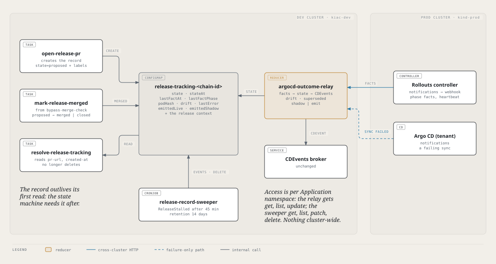
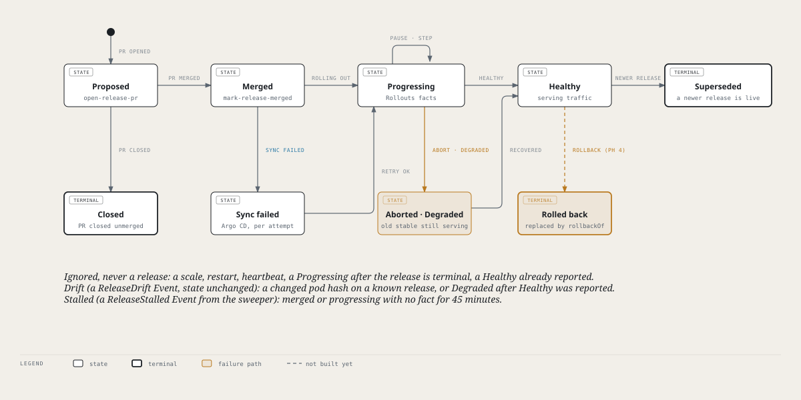
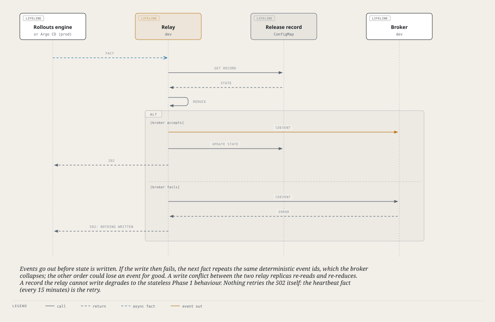

# Release state

Every release to an upper-cluster environment has a **record** on the dev cluster that says
where the release is: proposed, merged, rolling out, healthy, failed, superseded. The record
is what turns a stream of low-level facts from the prod cluster (a Rollout changed phase, a
sync failed) into the release events the rest of Glidepath consumes, and it is what lets the
platform tell a release from a scale, a restart or a manual edit.

This page is the reference. The decision and its history are in
[ADR-0021](adr/0021-rollout-facts-and-release-record.md) (with
[the phase 0 findings](adr/0021-phase0-findings.md) and
[phase 1 results](adr/0021-phase1-results.md)); the event vocabulary is
[ADR-0022](adr/0022-cdevents-conformance-and-vocabulary.md).



## The record

One ConfigMap per release, `release-tracking-<chain-id>`, in the Application's own namespace
(`app-<name>-cicd`) on the dev cluster. Labels: `hangar.io/subcomponent=release-tracking`,
`hangar.io/app`, `hangar.io/env`, `hangar.io/cluster`. The release is identified by
`releaseId`, `<chain-id>:<cluster>/<env>`, which also rides on the Rollout as the
`hangar.io/release-id` annotation so a fact can be joined to its record.

| Key | Written by | Meaning |
|---|---|---|
| `prUrl`, `prCreatedAt` | `open-release-pr` | The gitops release PR and when it opened. |
| `releaseId`, `kind` | `open-release-pr` | The release's identity; `promote`, or `rollback` (ADR-0021 phase 4). |
| `image` | `open-release-pr` | The image the release deploys. Rollback eligibility matches on it; records written before phase 4 have none and never qualify. |
| `rollbackOf`, `rollbackReason` | `open-release-pr` | A rollback only: the release-id it replaces, and why. |
| `appNamespace`, `appName`, `env`, `cluster` | `open-release-pr` | What was released and where. |
| `gitUrl`, `gitRevision`, `flowStartTime`, `configJson` | `open-release-pr` | The context the outcome events and the lead-time anchor need. |
| `state`, `stateAt` | `open-release-pr` (`proposed`), `mark-release-merged` (`merged`, `closed`), the relay (everything after) | Where the release is, and since when. |
| `mergedAt` | `mark-release-merged` | When the PR merged, recorded whatever state the release is in (Argo CD and the Rollout can start faster than the Task does, so the record may already be `progressing`: seen live). The stall alert's clock for a merged release, and the merge-to-deploy latency. |
| `lastFactAt`, `lastFactPhase` | relay | The last fact that arrived for this release. The stall alert's clock for a progressing release. |
| `podHash` | relay | The pod template hash of the release's first fact. A different hash later is drift. |
| `drift` | relay | The last drift description, if any. |
| `lastError` | relay | The last Argo CD sync error for this release. |
| `emittedLive`, `emittedShadow` | relay | The CDEvent kinds already sent, per mode (below). |
| `supersededBy` | relay | The release that replaced this one. |
| `healthyAt` | relay | When the release first reached `healthy`. Kept through `superseded` and `rolled-back`: "this image ran healthy here" is what rollback eligibility reads. |
| `rolledBackBy` | relay | The rollback release that replaced this one. |
| label `hangar.io/stall-alerted` | sweeper | The state a `ReleaseStalled` Event was already raised for. |

The record is **not deleted when its outcome is read** (it used to be). The state machine needs
it afterwards, and the sweeper removes it past its retention.

## The state machine



| Move | Caused by | Written by |
|---|---|---|
| (new) → `proposed` | The release PR opens | `open-release-pr` (also for Tower's Promote, see below) |
| `proposed` → `merged` | The gitops PR merges | `mark-release-merged`, run by `bypass-merge-check`, which is triggered by the **push to main the merge produces** (`resolve-merged-pr` turns the pushed commit back into the PR number; a push that is not a PR merge skips it). It only moves `proposed` (or a record with no state), never a state the relay owns. |
| `merged` → `progressing` | The Rollout reports `Progressing` or `Paused` | relay |
| `merged` → `sync-failed` | Argo CD reports a failing sync | relay |
| `sync-failed` → `progressing` | Argo's retry succeeded and the Rollout reports | relay |
| `progressing` → `healthy` | The Rollout reports `Healthy` | relay |
| `progressing` → `aborted` / `degraded` | The Rollout reports `Degraded` (`aborted` if the abort flag is set) | relay |
| `aborted` / `degraded` → `healthy` | The Rollout recovers | relay |
| `aborted` → `progressing` | Tower's *Retry*: a `Progressing` fact with the abort flag clear (no second `deploying` event; a later `Healthy` reports success, another abort goes back to `aborted`) | relay |
| `healthy` → `superseded` | A newer release of the same app, environment and cluster reports its first fact | relay |
| any ran state → `rolled-back` | A rollback release naming this one in `rollbackOf` turns healthy; one `service.rolledback` event is sent. Only a release of the same app, environment and cluster can be marked. | relay |

Tower's Promote to a Flight environment runs the same `release` Pipeline, from the
`promote-release` TriggerTemplate glidepath-app renders into each Kubernetes app's `-cicd`
namespace; Backstage fills its params and creates the PipelineRun. Until 2026-10-08 the
Backstage backend opened the release PR itself and wrote no record, so the relay dropped every
fact for a Tower-promoted release as `no-record`.

`sync-failed` is not terminal. `healthy`, `aborted`, `degraded`, `superseded`, `rolled-back`
and `closed` are.

### What a fact does

Facts are at-most-once and arrive repeated, out of order, and describing things that are not
releases (all of it observed on a real release). The reducer (`reducer.go`, a pure function, so
every row below is a plain test) handles it like this:

| Fact | Result |
|---|---|
| First `Progressing` or `Paused` for a release | State `progressing`; one `environment.deploying` event. |
| Further `Progressing`, `Paused`, or a heartbeat | Nothing. |
| `Healthy` | State `healthy`; one `environment.deployed` (success) event. A repeat, or a heartbeat, emits nothing. |
| `Degraded` | State `aborted` or `degraded`; one `environment.deployed` (failure) event. |
| The first fact seen is already `Healthy` or `Degraded` | The `deploying` event that was lost before it is sent first, then the outcome. |
| `Progressing` after the release is terminal | Ignored (Phase 1 saw one arrive in the same second as `Healthy`). |
| **Same release-id, different pod template hash** | **Drift**: a `ReleaseDrift` Event on the record, state unchanged, no CDEvent. A manual edit, or an `undo` that selfHeal has not yet reverted. A scale, a restart or a heartbeat keep the hash, so they are not drift and not releases. |
| `Degraded` after `Healthy` was already reported | Drift, not a failed deploy: the workload failed after a good release. |
| An Argo CD sync failure on a merged, progressing or sync-failed release | State `sync-failed`; `deploying` and a failure event, once per release however many retries. |
| An Argo CD sync failure with no such release in flight (a hand edit to `values.yaml`) | Ignored. |
| A release's first fact, while an older release of the same app, environment and cluster is live | The older one becomes `superseded` (best effort). |

The pod template hash is deterministic for a given template, but it is not an identity for
"the same image": rolling back to an earlier image can produce a different hash. The release-id,
not the hash, identifies a release.

## How a fact is applied



- **Events go out before state is written.** If the write then fails, the next fact repeats the
  same deterministic event ids (derived from the release-id, event type and outcome), which the
  broker's Triggers collapse. The other order could lose an event for good.
- **A failed forward returns 502 and writes nothing.** The sender does not retry, but the
  Rollouts engine re-sends current state every 15 minutes (its heartbeat), so the retry is the
  next heartbeat. Rollouts notifications are at-most-once and fail silently (phase 0); the
  heartbeat, and the prune CronJob that resets the engine's own state, are what make the stream
  recover.
- **A write conflict re-reads and re-reduces.** There are two relay replicas.
- **A record the relay cannot write** (no Role yet, or it vanished) degrades to the stateless
  behaviour of phase 1: the deterministic ids still make repeats harmless.
- **The hook Jobs are gone** (phase 3b/3c). While both ran, emit mode dropped the hook Jobs'
  copy of an event when the facts owned the release, and forwarded it as a fallback when they
  had not; that code, the `/outcome` endpoint and the hook script were deleted with the Jobs.
  A release whose facts are lost now waits for the next heartbeat (15 minutes), and the sweeper
  raises `ReleaseStalled` if none arrives.
- **Shadow and emit keep separate sent-sets** (`emittedShadow`, `emittedLive`). In `shadow`
  (opt-in; `outcomeRelay.factsMode` defaults to `emit`) the relay logs the event it would send
  as `shadow-event` and forwards nothing. Flipping to `emit` then sends the history instead of
  believing shadow already did.

### The two sources

| | Rollouts notifications (`POST /facts/<cluster>`) | Argo CD notifications (`POST /argocd/<cluster>`) |
|---|---|---|
| Reports | A tracked Rollout's phase, step and pod hash | A tenant Application's failing sync |
| Fires | On each phase change, plus a heartbeat every 15 minutes | On the first failed attempt (`retryCount > 0`) and on the final failure |
| Why | The Rollout is where the release's meaning lives | The Rollout never sees a sync rejected before it changes |
| Joined by | `hangar.io/release-id` on the Rollout | `hangar.io/app` and `hangar.io/env` labels, newest in-flight release |

Tenant Applications retry (limit 5, backoff up to 10 minutes), about 15 minutes to a final
`Failed`, and `operationState.phase` stays `Running` through the retries. A trigger on
`phase == Failed` alone would be 15 minutes late, which is why the first failed attempt fires.

## Stalls and retention

`release-record-sweeper` (control plane, every 10 minutes):

- raises a `ReleaseStalled` Event on a record that is `merged` with no fact for 45 minutes
  (the sync never started, or facts are not arriving), or `progressing` with no fact for 45
  minutes (the heartbeat arrives every 15), once per state;
- deletes records past 14 days: terminal and closed records by `stateAt`, proposed and
  state-less legacy records by creation time. A `merged` or `progressing` record is never swept,
  and neither are the newest five records per app, environment and cluster that reached
  `healthy` (the rollback-eligibility window, below).

The knobs are env vars on the CronJob (`RELEASE_STALL_MINUTES`, `RECORD_TTL_DAYS`, `KEEP_HEALTHY`).

## Rollback (ADR-0021 phase 4)

A rollback is a release of an earlier image: Tower's *Roll back* starts the app's
`rollback-release` TriggerTemplate (glidepath-app), the same `release` Pipeline as Promote with
`release-kind: rollback`, `rollback-of` and `rollback-reason`, and `config-revision` so
`cicd.yaml` is read at the app repo's `main` while provenance still checks the image's own
commit. `open-release-pr` records the kind, opens branch `release-rollback-<env>-<sha8>` and titles
the PR `Rollback:`.

The content gates (`sast`, `image-scan`, `sbom`) work out for themselves whether the promoted
image is an *eligible* rollback target: `extract-promoted-image`'s `rollback-eligibility` step
reads this app/environment/cluster's records and answers yes when one of the newest five that
reached `healthy` ran the same image. Then the gate runs its check as `<task>-advisory` with
`onError: continue`: the check run passes and the PR comment shows what it found. Integrity
gates (provenance, values, commit signing) and approvals are unchanged. The PR's own text and
trailers are never trusted for this.

## Permissions

Per Application namespace (`glidepath-app`, `identity/release-record-relay.yaml`), not
cluster-wide:

| Identity | Verbs on ConfigMaps in `app-<name>-cicd` | Also |
|---|---|---|
| `glidepath-relay` (platform-system) | get, list, update | create Events |
| `release-record-sweeper` (platform-system) | get, list, patch, delete | create Events |
| `pipeline-runner` (the Tekton tasks) | get, list, create, patch, delete (list added for `mark-release-merged`) | |

The relay's cluster-wide `get` on ConfigMaps from phase 1 (`glidepath-relay-records`)
remains until every namespace has the Role, then goes. The two infra apps (`skyport-auth`,
`skyport-broker`) have no release flow and no Role; the relay and sweeper skip them.

## Operating it

```bash
# every release's state, newest last
kubectl get cm -A -l hangar.io/subcomponent=release-tracking \
  -o custom-columns=NS:.metadata.namespace,NAME:.metadata.name,STATE:.data.state,SINCE:.data.stateAt,LAST_FACT:.data.lastFactAt

# one release in full
kubectl -n app-gate-api-cicd get cm release-tracking-<chain-id> -o yaml

# drift and stalls
kubectl get events -A --field-selector reason=ReleaseDrift
kubectl get events -A --field-selector reason=ReleaseStalled

# what the relay would send, if factsMode is shadow
kubectl -n platform-system logs -l app=glidepath-relay --prefix | grep shadow-event
```

## Tests

- `glidepath/broker`: `go test ./cmd/glidepath-relay`. The reducer's rows above, state
  persistence, a failed forward, a write conflict, an unwritable record, drift, supersede,
  shadow-then-emit, and the Argo CD endpoint.
- `charts/glidepath-catalog/tests/mark_release_merged_test.sh`,
  `charts/glidepath-catalog/tests/rollback_eligibility_test.sh` and
  `charts/glidepath-control-plane/tests/release_record_sweeper_test.sh` run the real Task and
  sweeper scripts against a stub `kubectl`.

## Not built yet

Moving the events onto the spec's vocabulary
([ADR-0022](adr/0022-cdevents-conformance-and-vocabulary.md)). Recording on the release that a
Tower *Promote full* skipped analysis (Backstage audits and announces it; the fact carries no
such field yet).

## Known gap: a PR closed without merging

`closed` (a PR closed unmerged) is in the state machine but nothing sets it yet. The merge signal is
the push to main, and an unmerged close produces no push. The record stays `proposed` until
retention deletes it (14 days). Nothing downstream depends on it.

## Live verification (2026-10-06)

Every scenario above was exercised against the real clusters, not only in unit tests: real
gate-api releases on kind-prod, and a synthetic Application namespace on kiac-dev driven
through the relay's real endpoints (with the real `mark-release-merged` Task and the real
sweeper CronJob).

| Scenario | How | Result |
|---|---|---|
| Merge marker, three cases (`proposed`, already `progressing`, already has `mergedAt`) | real Task run via the cluster resolver | `merged` + `mergedAt`; `mergedAt` only; untouched |
| Happy path with noise: repeated `Progressing`, `Paused`, `Healthy`, scale facts, heartbeats | synthetic facts | one `deploying` + one success, nothing more; state `healthy` |
| Late `Progressing` after `Healthy` | synthetic | ignored, reported in the response header |
| Scale, then restart, on a real healthy release | real Rollout on kind-prod | no CDEvent, no drift, state unchanged |
| Pod template edited by hand | real Rollout on kind-prod | `ReleaseDrift` Event naming `old -> new` hash, state unchanged, no CDEvent. **Raised 9 Events from one edit** (fixed: once per change) |
| `Degraded` after `Healthy` reported | synthetic | drift, no failure event |
| Abort, repeats, then recovery | synthetic | state `aborted`, one failure; recovery sends the success |
| First fact is already `Healthy` | synthetic | `deploying` sent first, then success |
| Newer release | real gate-api release, and synthetic with older/newer/unmerged neighbours | older live one `superseded` with `supersededBy`; an unmerged proposal and a newer record left alone; a superseded release's further facts send nothing |
| Rejected or ignored requests | synthetic | bad token 401; untracked, stale generation, unknown record, a namespace outside `app-*` all 202 and ignored; another cluster's release-id, a malformed id, and an env that differs from the record all 400 |
| Argo CD sync failure, first attempt through final failure | synthetic, through `/argocd/<cluster>` | `sync-failed`, one `deploying` + one failure however many retries, `lastError` kept; the Rollout then recovers it to `healthy` with the success sent; an unmerged proposal, another env, unlabelled apps and a healthy release are ignored |
| Stall alert and retention | real sweeper CronJob run | `merged` 2 h with no fact and `progressing` 90 min silent raise `ReleaseStalled` once; a recent progressing release does not; a healthy record past 14 days is deleted; a merged record is never swept; a second run raises nothing new |
| Prune CronJob | real, on kind-prod | the Rollout's `notified` annotation went from **90 keys to 4**, the engine resent state at once, no CDEvent, state unchanged, Argo CD still `Synced` |
| A namespace the relay has no Role in | synthetic | fact accepted, events still produced, a log line says it did not persist |

Not exercised live: a forward failure and the 502 retry (needs `emit` mode, unit-tested), a
write conflict between the two relay replicas (unit-tested), and a PR closed unmerged (the
known gap above). The retention of proposed and state-less legacy records is covered by the
sweeper's script test, because a record's creation time cannot be back-dated.
