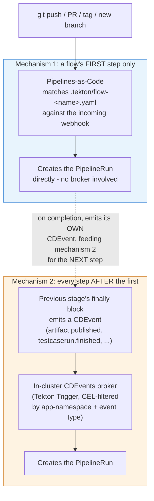
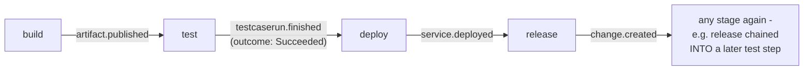

# `cicd.yaml` reference

`cicd.yaml` at an app repo's root is the **only** file a developer edits to control
their pipelines. There is no Tekton YAML to write, read, or understand - the platform
owns everything under `.tekton/` (pure boilerplate, generated at onboarding, see
[install-guide.md](install-guide.md)) and the shared catalog (`catalog/`).

This doc covers every field. If you just want a working file fast, see
[quickstart.md](quickstart.md) or copy one of [examples/](examples/) instead.


## Everything, annotated

Every field this schema accepts, in one place, with an inline comment explaining what
it does, its default, and whether it's actually load-bearing yet. Nothing here is
required except what's marked `REQUIRED` - most apps use a small fraction of this file.

```yaml
# --- Identity - both required, both fixed values today ---
apiVersion: platform/v1        # REQUIRED. Only one valid value.
kind: PipelineConfig           # REQUIRED. Only one valid value.

# --- build: REQUIRED block. Only `agent` inside it is required. ---
build:
  agent: nodejs-20              # REQUIRED. One of: nodejs-18, nodejs-20, nodejs-22,
                                 # openjdk-17, openjdk-21, python-3.11, go-1.22.
                                 # A named platform-catalog image, not a raw image
                                 # reference - keeps the step portable and centrally
                                 # patchable. Used for unit tests regardless of which
                                 # build strategy (below) you pick.
  script: ./build.sh            # Optional. Omit entirely to build your whole app
                                 # inside a multi-stage Containerfile instead (kaniko
                                 # builds `containerfile` directly, build-source is
                                 # skipped). Presence/absence is the switch - there's
                                 # no separate boolean, so a typo can't silently
                                 # disable it. Must be bash.
  containerfile: ./Containerfile # Optional, default "./Containerfile" ("Containerfile"
                                 # is this platform's vendor-neutral term for what
                                 # Docker calls a Dockerfile - same file, same format).
                                 # Packaging step if `script` is set; the whole build
                                 # if it's not.
  unitTest:
    enabled: true                # Optional, default true. false skips the unit-test
                                  # command but the stage still runs (span, notify).
    command: ./test.sh           # Optional, default "./test.sh".
  sonar: false                   # Optional, default false. Reserved field - see
                                  # features.md for current status.
  cache:
    enabled: false                # Optional, default false. Only applies to the
                                   # `script` build path - the Containerfile-only path
                                   # gets kaniko's own layer cache instead, for free.
    size: small                   # Optional, default "small". One of small (1Gi),
                                   # medium (2.5Gi), large (5Gi), xlarge (8Gi). Not
                                   # resizable after onboarding without losing the
                                   # cached content. No `type` field - derived from
                                   # `agent`'s prefix (nodejs-* -> npm cache,
                                   # openjdk-* -> Maven local repo). A no-op for
                                   # python-*/go-1.22 agents (not supported yet).
  sourceVolume:
    size: small                   # Optional, default "small". One of small (2Gi),
                                   # medium (5Gi), large (10Gi), xlarge (20Gi). Sizes
                                   # the ephemeral `source` workspace every stage's
                                   # PipelineRun gets (checked-out repo + build output +
                                   # kaniko's build context) - bump this if a build fails
                                   # with "no space left on device", NOT build.cache
                                   # (that's a separate, persistent dependency cache).
                                   # One value applies to every stage's source workspace
                                   # for this app, not build-only.

# --- test: optional block. See "The test: block" below for the full story. ---
test:
  enabled: true                 # Optional, default true. false skips the actual
                                 # test command but the stage still runs.
  name: integration              # The app-wide default TestWorkflow name every `test`
                                 # step inherits unless it sets its own `testName`. One
                                 # of this or a step's own `testName` MUST resolve to a
                                 # value - checked by validate-cicd-config.

# --- deploy: optional block. See "The deploy: block" below. ---
deploy:
  environments:                  # Optional, default [{name: dev, tier: ground}]. Every
    - { name: dev, tier: ground } # environment, once, in promotion order. A deploy step's
                                 # `env` (below, under pipelines:) MUST be listed here, a
                                 # release step's must be tier: flight, or
                                 # validate-cicd-config rejects the flow before anything
                                 # runs. A flight env on another physical cluster sets
                                 # cluster: - see docs/multi-cluster.md.
  strategy: rollout               # Optional, default "rollout" (Argo Rollouts
                                 # canary/blue-green) - the only strategy actually
                                 # implemented. "deployment" is still schema-valid
                                 # but has NO EFFECT - nothing renders a plain
                                 # Deployment anymore.

# --- ephemeralEnvironments: optional block. See features.md for the full writeup. ---
ephemeralEnvironments:
  branch:
    enabled: false                # Optional, default false. Spin up a real,
                                   # temporary deploy per matching branch.
    patterns: ["preview/*"]       # Optional, default ["preview/*"]. Glob(s) a
                                   # branch name must match to get its own env.
  pullRequest:
    enabled: false                # Optional, default false. Same idea, gated on a
                                   # PR label instead of a branch name.
    labels: ["preview"]           # Optional, default ["preview"]. PR must carry one
                                   # of these labels to get an ephemeral env.
  ttl: 5d                        # Optional, default "5d". Pattern: digits + h or d.
                                 # How long an ephemeral env survives after its last
                                 # successful deploy before automatic teardown.

# --- governance: optional block. Real gates, not stubs - see features.md. ---
governance:
  sast: false                    # Optional, default false. Real Semgrep scan.
  imageScan: false               # Optional, default false. Real Trivy scan.
  policyCheck: false             # Optional, default false. Only gates a build-time
                                 # shift-left copy of this check, if one exists - the
                                 # release-gate gitsign commit-signature check itself
                                 # always runs regardless of this flag (release gates
                                 # are enforced, not app-configurable).
  sbom: false                    # Optional, default false. Real cosign SBOM
                                 # attestation.
  allowedCommitSigners: []       # Optional, default []. Plain email addresses (not
                                 # regex) - always consulted by the release-gate check;
                                 # leaving this empty fails that check on every release.

# --- notifications: optional block. ---
notifications:
  slack:
    enabled: false                # Optional, default false. Per-stage pass/fail
                                   # notifications to `channel`.
    channel: "#team-deploys"      # Required if slack.enabled is true. No default.
    scanResults: true             # Optional, default true. Separate, shift-left
                                   # notifications the moment a real governance scan
                                   # (sast/imageScan) produces a result, independent
                                   # of the general per-stage notification above. Only
                                   # takes effect when slack.enabled is also true.
  backstage:
    enabled: false                # Optional, default false. Same general per-stage
                                   # pass/fail notification as slack.enabled above, sent
                                   # instead (or as well - independent toggles) into
                                   # Backstage's own Notifications plugin, broadcast to
                                   # every Backstage user and visible in Tower's
                                   # Notifications tab. No channel/scanResults fields -
                                   # broadcast-only, general per-stage notification only.
                                   # Requires the cluster's glidepath-catalog chart to be
                                   # configured with backstageBaseUrl and a
                                   # glidepath-backstage-notify token Secret - see
                                   # ../admin/notifications.md. Silently no-ops on a
                                   # cluster where that isn't set up.

# --- secrets: optional. Pulls keys from this app's own backend secret store. ---
# See ../admin/app-secrets.md - open-ended by design, not just for Slack.
secrets:
  - name: slack-webhook-url     # Becomes a key in this app's app-secrets Kubernetes
                                 # Secret. A consuming Task (notify-slack.yaml today)
                                 # mounts app-secrets and reads this exact filename.
  - name: sast-scan-token       # Any future purpose works the same way - no schema or
    key: sast-creds-token       # template change needed, just a new entry here. `key`
                                 # (optional) is the name as it exists in the backend
                                 # store, when different from the name you want here -
                                 # defaults to `name` when omitted, as in the entry above.

# --- pipelines: optional, but the whole point of this file for most apps. ---
# A map of named flows. Each flow has a `trigger` (fires the FIRST step only) and an
# ordered `steps` list (chaining is purely positional - see "How flows work" below).
pipelines:
  <flow-name>:                  # Any name you want - becomes part of generated
                                 # Trigger/PipelineRun object names, so keep it short
                                 # and identifier-safe.
    trigger:
      source: git                # "git" (PaC/webhook-triggered - only valid for a
                                  # flow's FIRST step) or "event" (CDEvents broker -
                                  # not yet supported for a flow's first step, only
                                  # meaningful internally).
      event: push                # One of: push, pull_request, tag, branch.created
                                  # (git sources); deploy/artifact.published/
                                  # testcaserun.finished/service.deployed/
                                  # change.created (internal CDEvents, not for you to
                                  # set directly). No release.created - GitHub sends
                                  # no such webhook PaC can receive; use `tag`
                                  # instead (publishing a Release also creates the
                                  # tag).
      branch: main                # Exact branch name, OR a glob like "release/*".
                                  # Used by push/pull_request (via PaC's own
                                  # on-target-branch matcher) AND by branch.created
                                  # (via a CEL regex the platform builds for you).
      branchPattern: ""           # Accepted by the schema but not currently
                                  # consumed anywhere in the platform - use `branch`
                                  # (it already accepts glob patterns) instead.
      tagPattern: "v[0-9]+\\.[0-9]+\\.[0-9]+"   # REQUIRED when event is "tag". A
                                  # regex (not a glob) the pushed tag name must
                                  # match. Backslash escapes are handled correctly.
      filePathPattern: ["api/**"]  # Optional. Only trigger when a changed file
                                  # matches one of these globs. push events only.
      labels: ["preview"]        # Optional, pull_request events only. Only trigger for
                                  # a PR carrying ALL of these GitHub labels (same
                                  # all-must-match semantics as ArgoCD's own pullRequest
                                  # generator `labels:` field - see
                                  # ephemeralEnvironments.pullRequest above). Omit for no
                                  # label filter (fires on every PR touching this
                                  # branch). If you're building an image for
                                  # ephemeralEnvironments.pullRequest to deploy, match
                                  # this to that same label or you'll build on every PR,
                                  # not just ones that actually get an environment.
                                  #
                                  # You normally don't need to write a pipelines.pr-build
                                  # entry at all: setting ephemeralEnvironments.
                                  # pullRequest.enabled: true is enough on its own - the
                                  # platform synthesizes exactly this flow shape
                                  # automatically (branch reused from your push flow,
                                  # labels reused from ephemeralEnvironments.pullRequest.
                                  # labels). Only declare pipelines.pr-build yourself to
                                  # override that default - see
                                  # ../admin/ephemeral-environments.md.
    steps:
      - stage: build              # REQUIRED per step. One of build/test/deploy/
                                   # release. build, if present, must be the flow's
                                   # first step - nothing chains into it.
        env: dev                  # Required for test/deploy/release steps; not
                                   # valid on build. Which environment this step
                                   # targets/exercises.
        testName: integration      # Only meaningful on a test step - see the test:
                                   # block above. Not called `name` - see below.
        cluster: prod-cluster     # Only valid on a release step. Optional - only set
                                   # this if you want an explicit consistency check
                                   # against deploy.environments' own cluster for
                                   # this env (they must agree); normally the cluster
                                   # resolves from there and this can be omitted. See
                                   # docs/multi-cluster.md.
        name: my-label            # Optional free-text label, passed through to the
                                   # generated PipelineRun's params. Cosmetic today.
                                   # A different field from testName above - this one
                                   # exists on every step, testName only matters on a
                                   # test step.
```

## Design rules this file follows

- **Read fresh, every run, from the triggering commit.** `validate-cicd-config` (always
  the first Task in every Pipeline) reads `cicd.yaml` straight out of the cloned
  workspace and validates it on the spot. There is deliberately no ConfigMap sync, no
  cache, no second copy anywhere - a `cicd.yaml` change takes effect on the very next
  push, full stop.
- **Fixed superset DAG, not arbitrary graphs.** `pipelines:` toggles and orders a known,
  finite stage set (`build`, `test`, `deploy`, `release`). It cannot express an
  arbitrary DAG - that would require compiling a bespoke Pipeline per app, a meaningfully
  heavier engineering commitment than is justified until there's real evidence apps need
  it.
- **`governance` toggles are honest about being real, not stubs.** Setting
  `governance.sast: true` runs a real Semgrep scan - see [features.md](features.md) and
  [../admin/governance-stubs.md](../admin/governance-stubs.md) for exactly what each gate verifies.

## Two build strategies: `build.script`, or a multi-stage Containerfile

`build.script` (e.g. `./build.sh`) is **optional**, not required. Two ways to structure
a build, pick whichever fits:

- **Script + thin Containerfile** (the common shape - see
  [examples/02-standard-ci.yaml](examples/02-standard-ci.yaml)): `build.script` does the
  actual build (`npm ci && npm run build`, `mvn package`, ...) inside the resolved
  `build.agent` image, and `build.containerfile` becomes a thin packaging step that just
  copies the already-built artifacts. This runs as its own Tekton Task (`build-source`),
  concurrently with unit tests.
- **Everything in a multi-stage Containerfile** (see
  [examples/08-containerfile-only-build.yaml](examples/08-containerfile-only-build.yaml)):
  omit `build.script` entirely and do the whole build inside `build.containerfile`
  (`FROM ... AS builder` / `RUN npm ci && npm run build` / `COPY --from=builder`). The
  `build-source` Task is skipped entirely and kaniko builds the Containerfile directly.
  Build caching in this path comes from kaniko's own layer cache, not `build.cache` -
  order your Containerfile's `COPY package*.json` / `RUN npm ci` *before* copying the
  rest of the source, or the cache invalidates on every source change regardless of
  whether dependencies changed.

`build.agent` is required either way - unit tests always run inside it, independent of
which build strategy you pick.

## Version metadata inside the image (`HANGAR_VERSION`/`HANGAR_GIT_REVISION`)

Every `build-image` invocation passes two build args to your Containerfile automatically,
regardless of build strategy - no `cicd.yaml` field turns this on, it's always available:

- `HANGAR_VERSION` - the same version `build-image` resolved for the image tag (from a
  git tag, `package.json`, `pom.xml`, `pyproject.toml`, or a `VERSION` file, in that
  order - see "How the image tag is resolved" below).
- `HANGAR_GIT_REVISION` - the full git commit SHA being built.

Declare an `ARG` for whichever one you want and use it however your language needs -
nothing consumes these automatically, so an app that doesn't declare the `ARG` sees no
effect at all (kaniko silently ignores a `--build-arg` with no matching `ARG`). The
motivating case is Go, which has no manifest-embedded version convention the way
Node/Python/Maven do:

```dockerfile
FROM golang:1.24-alpine AS build
ARG HANGAR_VERSION
ARG HANGAR_GIT_REVISION
RUN go build -ldflags "\
      -X example.com/payment-api/version.Version=${HANGAR_VERSION} \
      -X example.com/payment-api/version.Commit=${HANGAR_GIT_REVISION}" \
      -o /out/payment-api ./cmd/payment-api
```

The same two args are also set as this image's `org.opencontainers.image.version` and
`org.opencontainers.image.revision` OCI labels (readable via `crane config`/`docker
inspect` with no Containerfile changes needed) - the build-arg path is only for baking
version info *inside* the binary itself, which the OCI labels alone can't do.

## Additional artifacts (`build.artifacts`)

Optional, empty by default - most apps don't need this. Publishes one or more
*additional* non-container artifacts from the same build, alongside (not instead of)
the primary container image:

```yaml
build:
  agent: go-1.24
  artifacts: [go-binary]
```

```yaml
build:
  agent: python-3.12
  artifacts: [python-wheel]
```

Each declared type builds inside your resolved `build.agent` image (`python -m build
--wheel` for `python-wheel`, `go build` for `go-binary`, `linux/amd64` only today) and
publishes as a real, pullable OCI artifact - not a container image, but a real object in
the same registry - at `<image-repo>:<version>-<type>` (e.g.
`ghcr.io/acme/payment-api:1.8.3-go-binary`), using the same `registry-credentials` your
container image already pushes with. No separate publish target or credential to
configure. Pull it with `oras pull <ref>`.

The version always matches the container image's own resolved version exactly (both are
read from the same `build-image` result) - there's no separate version-resolution path
to drift out of sync.

## Build dependency caching (`build.cache`)

Only applies to the `build.script` path above - the multi-stage-Containerfile path
caches via kaniko's own layers instead (see above). Opt in with:

```yaml
build:
  agent: nodejs-20
  script: ./build.sh
  cache:
    enabled: true
    size: small   # small=1Gi, medium=2.5Gi, large=5Gi, xlarge=8Gi - default small
```

No `type` field - it's derived from `build.agent`'s prefix (`nodejs-*` -> npm, or yarn when the repo has a
`yarn.lock` and no `package-lock.json`; `openjdk-*` -> Maven), not a second, separately-declarable value that could disagree with `agent`.
Agents without cache support yet (`python-*`, `go-1.22`) treat `enabled: true` as a no-op
(logged, not an error).

What's actually cached is the build tool's own *download* cache (npm's tarball cache,
yarn's package cache, Maven's local repository) - not `node_modules`/`target` directly, since `npm ci` deletes
and rebuilds `node_modules` from scratch by design. The cache is a real, persistent,
**per-app** PVC, keyed by a hash of the relevant lockfile (`package-lock.json`/`pom.xml`)
so a dependency change invalidates it automatically rather than serving stale packages.
Yarn is the exception: its cache holds one file per `package@version` and is never stale,
so it is one shared directory (`YARN_CACHE_FOLDER`/`YARN_GLOBAL_FOLDER`, global cache
forced on for Berry) and a lockfile change only fetches the packages that changed. It only
grows as versions are added; delete the PVC to reset it.
Not resizable live after onboarding - changing `size` later means recreating the PVC
(losing its content).

## Build source volume (`build.sourceVolume`)

Every stage's PipelineRun clones the repo into a `source` Tekton workspace - the checked-
out tree, `build.script`'s own output (`dist/`, `target/`, ...), and kaniko's build
context all live there. For most apps the default is plenty; a large monorepo-style repo
or a build that produces a lot of intermediate output can fill it, which shows up as a
build failing with `no space left on device` rather than any error from your own build
script. Bump it with:

```yaml
build:
  agent: nodejs-20
  script: ./build.sh
  sourceVolume:
    size: medium   # small=2Gi, medium=5Gi, large=10Gi, xlarge=20Gi - default small
```

This is a different volume from `build.cache` above - `sourceVolume` is the ephemeral,
per-*run* working directory (a fresh `volumeClaimTemplate`-backed PVC every PipelineRun,
torn down when the run completes), while `build.cache` is the persistent, per-*app*
dependency-download cache that survives across runs. Sizing `sourceVolume` up doesn't
help a slow dependency install; sizing `build.cache` up doesn't help a build running out
of disk. One `sourceVolume.size` applies to every stage's `source` workspace for the app
(build/test/deploy/release), not just build's - simpler than a per-stage knob, and build
is normally the only stage large enough to need it anyway. Since it's a fresh PVC every
run, there's nothing to migrate: a size change just takes effect on the next PipelineRun.

## The `test:` block

```yaml
test:
  enabled: true       # default true
  name: integration   # falls back to nothing - see "How flows work" below, one of
                       # test.name or a step's own `testName` must be set
```

`test.name` is the app-wide default TestWorkflow name, inherited by every `test` step in
every flow that doesn't set its own `testName`. `enabled: false` skips the stage's actual
test run but the stage still runs (span, CDEvent, Slack notification) - it just reports
success without having tested anything.

Whatever name is in effect resolves to one of two things, checked in this order:

1. **`glidepath/<name>.yaml` (Testkube, preferred)** - if this file exists, it's applied
   as a Testkube `TestWorkflow` and run for real. It doesn't have to be a test in the
   strict sense - a TestWorkflow is just "a thing that runs and reports pass/fail," so
   `glidepath/<name>.yaml` is equally at home clearing a cache or running some other ops
   action before release as it is running assertions against your code. Testkube CE
   installs into one shared `testkube` namespace on this cluster (not one per
   Application - cross-namespace execution is a Testkube Pro/Enterprise-only feature),
   so two things about this file are enforced by the platform, not left to convention:
   - `metadata.name` is always overwritten to `<your-app-name>-<name>` before applying,
     regardless of what you put there - required so TestWorkflow names stay unique
     across every onboarded Application sharing that one namespace.
   - To reference your own app-secrets in the workflow's env, use the literal
     `secretKeyRef.name` value `__APP_SECRETS_NAME__` - it's substituted for your
     Application's real, per-Application secret name in that shared namespace before
     applying. Don't hardcode a real secret name; it won't exist under that name.
     ```yaml
     env:
       - name: API_TOKEN
         valueFrom:
           secretKeyRef: { name: __APP_SECRETS_NAME__, key: api-token }
     ```
     Whatever's in this namespace's own `app-secrets` (the `secrets:` block earlier in
     this file) is what shows up there - same keys, materialized fresh into Testkube's
     namespace immediately before each run and blanked again immediately after. A
     Kyverno policy in the `testkube` namespace enforces that `secretKeyRef.name` here
     can only ever resolve to your own Application's secret, not another tenant's - see
     `../admin/adr/0008-kyverno-testkube-secret-policy.md`.
   - See the TestWorkflow CRD docs (docs.testkube.io) for the rest of `spec:` - image,
     command, assertions, etc. are all standard Testkube, nothing platform-specific
     beyond the two rules above.
2. **`./integration-test.sh` (fallback)** - if there's no `glidepath/<name>.yaml`, this
   runs instead, in your own `build.agent` image. Whatever name is in effect, plus the
   step's `env` and the image reference under test, reach it as
   `TEST_NAME`/`TEST_ENV`/`IMAGE_REF` environment variables. This is the original,
   pre-Testkube mechanism - kept working for Applications that haven't added a
   `glidepath/<name>.yaml` yet, not the recommended path for a new Application.

Neither present: the stage still runs (span, CDEvent, notification) but reports success
without having tested anything, same as `enabled: false`.

## The `deploy:` block

```yaml
deploy:
  strategy: rollout             # default; the only strategy actually implemented -
                                 # every deploy provisions an Argo Rollout.
  environments:                  # default: one Ground environment, dev
    - { name: dev, tier: ground }
```

`environments` (below) is not the thing that decides where a flow deploys - that is each
`deploy`/`release` step's own `env:` under `pipelines:` (below). A `deploy` step's `env` must
be listed in `environments`, and a `release` step's `env` must be a `flight` one - either is a
`validate-cicd-config` rejection before anything runs, rather than failing later (a bare
`Forbidden` deep inside the deploy Task, in the deploy case).

For `deploy`, the list provisions RBAC (the pipeline runner's read access to the Rollout, per
environment) - `deploy` always stays on this cluster. A `flight` environment can set `cluster`,
naming a different physical cluster its ArgoCD Application lives on (resolved against the
control-plane chart's own cluster registry) - see [multi-cluster.md](../admin/multi-cluster.md)
for how the release PR delivery and ArgoCD feedback path differ for such an environment.

### `environments` - the environments, defined once

`deploy.environments` declares every environment once, in promotion order (ADR-0019). It
replaced `lowerEnvironments`, `upperEnvironments` and `promotionOrder`, which were removed on
2026-10-07 after every app moved; `validate-cicd-config` and the chart now refuse them with a
pointer here.

```yaml
deploy:
  environments:                       # the order here is the promotion order
    - { name: dev,     tier: ground }
    - { name: test,    tier: ground }
    - { name: staging, tier: flight, cluster: kind-prod }
    - { name: prod,    tier: flight, cluster: kind-prod }
```

| Field | Meaning |
|---|---|
| `name` | Lowercase letters, digits and `-`, starting with a letter, at most 31 characters; unique. |
| `tier` | `ground`: deployed automatically on every push. `flight`: deployed only through a release PR and its guardrails (a release pin PR for a cloud target, ADR-0020). |
| `cluster` | Flight only, and only when the environment runs on another cluster than the app's own. A Ground environment cannot set it yet. |

The list order is the promotion order: Tower promotes from each environment to the next, and a
release names the environment it came from by it.

#### Per-environment cloud resources

A cloud app deploys to the resource named under `deploy.<target>` (`lambda`, `ecs` or
`azureContainerApps`). An environment can override fields of that block, so `dev` and `test` deploy
to different functions, services or Container Apps. The override is partial: fields it does not set
come from the app-level block.

```yaml
deploy:
  target: aws-lambda
  lambda:
    functionName: orders-fn          # the default, used by dev
    region: us-east-1
  environments:
    - { name: dev,  tier: ground }
    - { name: test, tier: ground, lambda: { functionName: orders-fn-test } }
    - { name: eu,   tier: ground, lambda: { functionName: orders-fn-eu, region: eu-west-1 } }
```

An environment may only override the block for the app's own target (a `lambda` override on an ECS
app is refused), and the target itself is per app, not per environment. The deploy step for
environment `test` resolves to `orders-fn-test` in `us-east-1`. The resources must already exist,
as before: Glidepath only updates what is there. Credentials are still one set per app, so every
environment must be reachable with them.

### `chart` - the Helm chart your environments render

Unset (every app today), each environment renders the cluster's default chart, Airframe's
`airframe-application` at the version the platform team pins in the cluster's
`cluster-defaults.yaml`. Set `deploy.chart` to pin another version or your own chart, and an
environment's `chart` to change one environment only (a canary of a new chart version):

```yaml
deploy:
  chart:                                   # app-wide; fields not set come from the cluster default
    repoURL: https://github.com/<owner>/<repo>
    path: charts/<chart>                   # a git source; or `chart: <name>` for a Helm/OCI registry
    targetRevision: v1.2.3
  environments:
    - name: dev
      tier: ground
      chart: { targetRevision: v1.2.4 }    # this environment only, merged over deploy.chart
```

Precedence, highest first: the environment's `chart`, then `deploy.chart`, then the cluster
default. Pinning a newer Airframe chart is just `targetRevision`. A chart from another source
needs `repoURL`, `targetRevision`, and `path` (git) or `chart` (registry), never both (it inherits nothing from the default), and must meet the
[chart contract](../admin/chart-contract.md). Only a Kubernetes app (`target: k8s-rollout`) has a
chart. Design: [ADR-0023](../admin/adr/0023-per-app-chart-deploy-chart.md). The field is accepted
and validated now; environments start rendering it as ADR-0023's later slices land (Ground
environments in slice 3, Flight in slice 4).

### `target` - deploying somewhere other than this cluster

Optional, defaults to `k8s-rollout` - every existing app is unaffected. Set
`deploy.target: aws-ecs` to have the `deploy` stage update an ECS service directly
instead of provisioning an Argo Rollout on this cluster:

```yaml
deploy:
  target: aws-ecs
  ecs:
    cluster: my-ecs-cluster
    service: my-service
    containerName: my-app        # must match a real container name in the current
                                  # task definition - checked, not assumed
    region: us-east-1            # default
    # taskDefinitionFamily: ""   # defaults to "<app-name>-<env>"

secrets:
  - name: aws-access-key-id
  - name: aws-secret-access-key
```

The two `secrets:` entries are required for `aws-ecs` - credentials come from this
app's own secret store (see [app-secrets.md](../admin/app-secrets.md)), the same
mechanism every other per-app credential already uses, not a new platform-wide AWS
account. `deploy-ecs.yaml` registers a new task-definition revision with the built
image, updates the named service to it, and waits for ECS's own stability check -
nothing is deployed via this cluster's ArgoCD/Rollout machinery for this target.

#### `aws-lambda`

```yaml
deploy:
  target: aws-lambda
  lambda:
    functionName: my-function
    region: us-east-1           # default

secrets:
  - name: aws-access-key-id
  - name: aws-secret-access-key
```

Updates an existing Lambda function's container image and waits for the update to
complete.

Lambda can only pull a container image from Amazon ECR, never from `ghcr.io`, where this
pipeline builds, signs and scans everything. So the deploy stage copies the image for you:

1. It reads the function's architecture and the ECR repository its **current** image lives
   in (so there is no repository field to set; the function must already exist with an
   ECR image).
2. It copies the matching per-architecture image (`<tag>-arm64` or `<tag>-amd64`) into that
   repository with your `aws-*` secrets and checks the digest is unchanged. Lambda does not
   accept a multi-architecture image index, so the function's architecture decides which
   one is copied. Your `build.platforms` must include it (an app that built only `amd64`
   cannot deploy to an `arm64` function, and the stage says so).
3. It updates the function to that ECR digest and waits for the update to finish.

The function and its ECR repository are yours to create first; Glidepath never creates
them. Signatures and attestations stay on `ghcr.io` (the digest is the same, so they remain
verifiable there). An app that already builds to ECR skips the copy.

#### `azure-container-apps`

```yaml
deploy:
  target: azure-container-apps
  azureContainerApps:
    resourceGroup: my-resource-group
    appName: my-container-app

secrets:
  - name: azure-client-id
  - name: azure-client-secret
  - name: azure-tenant-id
```

Updates an existing Container App's image to a new revision and polls it for a
healthy state. The three `secrets:` entries are an Azure AD service principal
(`az login --service-principal`) - scope its role to just this Container App if
possible. The Container App must already exist, including any private-registry pull
credentials it needs (configured on the resource itself, out of band) - this never
creates the app.

---

All three cloud targets resolve correctly even for a git-rooted deploy (a tag push
with no build/test in that same run), not just the normal build → test → deploy flow -
`resolve-deploy-target` clones just `cicd.yaml` directly when it has no upstream
config to inherit, and every cloud-target Task reads that same resolved config rather
than re-deriving it. **None of the three are live-verified** - no AWS or Azure account
exists in the environment this was built in. See
[known-gaps.md](../admin/known-gaps.md).

## Multi-stage pipeline flows

The `pipelines:` field enables declarative control of multi-stage, self-chaining
pipelines. Rather than configuring individual legacy triggers, teams declare named flows
with a root trigger source and a sequence of stages. Each flow runs the corresponding
catalog Pipeline (`build`, `test`, `deploy`, `release`) - no custom Pipelines or DAG
configuration needed.

**Editing `pipelines:` has two independent effects, not one** - easy to forget:
changing `cicd.yaml`'s `pipelines:` section and pushing it does NOT, by itself, change
which event-chained Triggers exist in the cluster. That only happens via `helm upgrade`
of the app chart picking up the new `cicd.yaml` as its values file - see
[../admin/onboarding-mechanics.md](../admin/onboarding-mechanics.md). The git push side (delivering the updated
git-rooted `.tekton/*.yaml` PipelineRun definitions) is fully automatic; the
cluster-side Trigger/TriggerBinding/TriggerTemplate objects are not - re-run
`helm upgrade` yourself after any `pipelines:` edit that adds, removes, or reorders
event-chained steps, or the new stages simply won't fire (the git-rooted root stage
still will, since that part IS automatic, which is what makes this easy to miss).

### How flows work

**Two entirely different mechanisms fire a flow's steps**, depending on position:



`deliver-onboarding-files.yaml` generates one `.tekton/flow-<name>.yaml` file per flow
for mechanism 1, driven by your `cicd.yaml`'s `pipelines:` section - see
[../admin/onboarding-mechanics.md#keeping-onboarding-boilerplate-in-sync](../admin/onboarding-mechanics.md#keeping-onboarding-boilerplate-in-sync). Mechanism 2
is what `helm upgrade` provisions, per the "two independent effects" warning above.

**Trigger sources**: The root trigger can be `git` (pushed webhook from
Pipelines-as-Code, for build/release/deploy/test stages) or `event` (CDEvent broker, not
currently a supported way to configure a flow's first step - only used internally).
Subsequent stages are always event-chained: each stage's completion emits a CDEvent that
the next stage listens for.

**Event chaining rules** - keyed by whichever stage the step actually follows, not by
the step's own identity, so any of these pairings works in any combination (confirmed
live, including the less obvious `release` → `test` case):



The event a step listens for is determined entirely by **whichever stage the previous
step in your `steps:` list actually is** - not by the new step's own identity. That's
why `release → test` (an unusual-looking order) works exactly the same way as
`build → test`: `flow-triggers.yaml` looks up the event type from the previous step's
stage name, not from a fixed build→test→deploy→release sequence.

- `build` → next: triggered by `artifact.published` (image built and pushed)
- `test` → next: triggered by `testcaserun.finished` with `outcome: Succeeded` (`test`
  is the one stage whose domain event fires unconditionally, pass or fail - every other
  stage's event is already gated at the source, so only this transition needs the
  outcome check)
- `deploy` → next: triggered by `service.deployed`
- `release` → next: triggered by `change.created`

**Tracing across stages**: Each flow gets a `chain-id` and OpenTelemetry `traceparent` at
the root stage, threaded through all subsequent stages via CDEvent payloads. The
flow-root span covers the entire automated pipeline execution (all stages' durations),
not including human review/merge time.

**Chaining order is positional, full stop.** There is no `after:` field - an earlier
draft had one, but nothing ever read it (chaining was always determined by a step's
index in the `steps:` list, looking at whichever stage the previous entry declares), so
it was pure decoration that could silently disagree with what actually ran. It was
removed rather than left in place. Write your steps in the order they execute.

**Every `test` step needs `env` and a resolvable test name.** `env` says which
environment's build this run is exercising (there's no default - a test result is
meaningless without knowing what it ran against). The test name can come from either
the step's own `testName`, or the top-level `test.name` shared by every test step in the
app - one of the two has to resolve, checked by `validate-cicd-config` before anything
runs. The step-level override only matters once a flow has more than one test step (the
two-step case: hitting the same build with two different TestWorkflows) - otherwise just
set `test.name` once and every test step inherits it. Both `env` and the resolved test
name, along with the image reference under test, reach your own `./integration-test.sh`
as `TEST_ENV`, `TEST_NAME`, and `IMAGE_REF` environment variables.

**A `deploy` step's `env` must be provisioned.** It has to be listed in
`deploy.environments` (see above) - that's the list the pipeline runner is granted access
into. Declaring `env: staging` on a deploy step without also listing `staging` under
`deploy.environments` is rejected at `validate-cicd-config` time, instead of
failing later with a bare `Forbidden` RBAC error deep inside the deploy Task.

### Event-chained flows (downstream chaining)

Stages after the root are always event-chained - they're triggered by CDEvents emitted
by the previous stage, not by new git events. This is automatic: when you declare a
multi-stage `steps:` list, the platform wires up the event triggers for you (after a
`helm upgrade` - see above).

The **only exception** is if you omit a stage from the flow - say, you configure
`build` → `deploy` with no `test` stage. In that case, `deploy` still waits for
`artifact.published` from `build`; the platform doesn't create a path for `build` to
directly trigger `deploy`. If you need to skip stages conditionally, use the app's own
`cicd.yaml` to enable/disable stages, not the pipelines flow structure.

### Migration from legacy list form

Earlier cicd.yaml files used a list form for the `pipelines:` field:

```yaml
# Legacy (still supported) list form
pipelines:
  - task: build
    trigger: push
    branch: main
  - task: test
  - task: deploy
    triggerEnv: dev
```

This is automatically normalized to the new object form internally. The new form is
preferred for clarity, especially when naming flows or using event-based triggers.

### Local validation before pushing

Run `yajsv -s schemas/cicd.schema.json <(yq -o=json . cicd.yaml)` locally (same tool
`validate-cicd-config` uses) to catch schema errors before a push burns a pipeline run
finding them for you.

## Real bugs found in this mechanism, fixed - worth knowing about if something looks wrong

**`enabled: false` silently ineffective (fixed).** `build.unitTest.enabled` and
`test.enabled` both used to be read via `jq -r '.path.enabled // true'` - jq's `//`
operator treats `false` the same as `null`/missing, so an explicit `enabled: false` was
silently overridden back to `"true"`. No Application had ever actually been able to
disable unit tests or the test stage via `cicd.yaml` until this was found
and fixed. Verified live: `unitTest.enabled: false` now genuinely skips the test
command.

**Tests never actually ran, for anyone, ever (fixed).** A separate, deeper
bug in the same area: the test stage's Task (`run-integration-tests.yaml` at the time,
since renamed to `run-testworkflow.yaml`) had its internal result-passing write a
value with a trailing newline that a cross-step variable substitution doesn't strip
(`"true\n"` instead of `"true"`), so its own enabled-check always evaluated false
regardless of the real config. Every test run silently reported "disabled...
skipping." Fixed and confirmed live - a real test command now genuinely runs.

**`branch.created`'s `branch` pattern used to be ignored entirely (fixed).** The CEL
filter generated for a `branch.created` trigger never consulted `trigger.branch` at all
- any newly created branch fired the flow, regardless of the pattern you set. Confirmed
live both before (fired on a non-matching branch) and after the fix (correctly filtered:
a matching `preview/x` branch fired it, a non-matching one didn't).

None of the above require anything from you - they're platform-side fixes, documented
here so a `cicd.yaml` that looked like it "should" have worked before now actually does.
